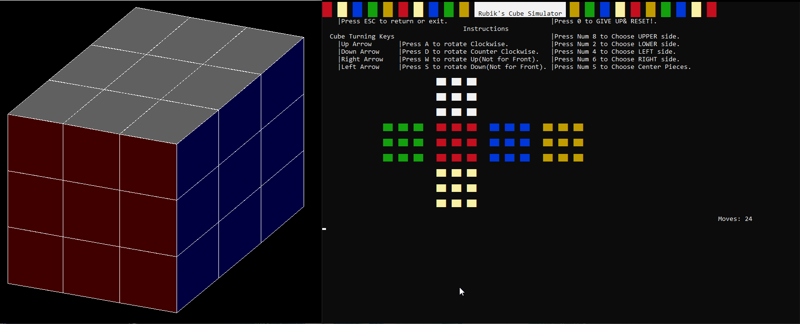

### RUBIKS CUBE GAME

A Rubik's cube game based in a console environment. Entirely written in C++.

##### Note 

This app uses an external library, graphics.h. Please try to install this as it is a core dependency.

[Installation Guide](https://www.geeksforgeeks.org/include-graphics-h-codeblocks/) if you're using CodeBlocks.

[Installation Guide](https://home.cs.colorado.edu/~main/bgi/dev-c++/) if you're using Dev C++.

If you find it to be too much work you can run our compiled executable found in the root of this repo.